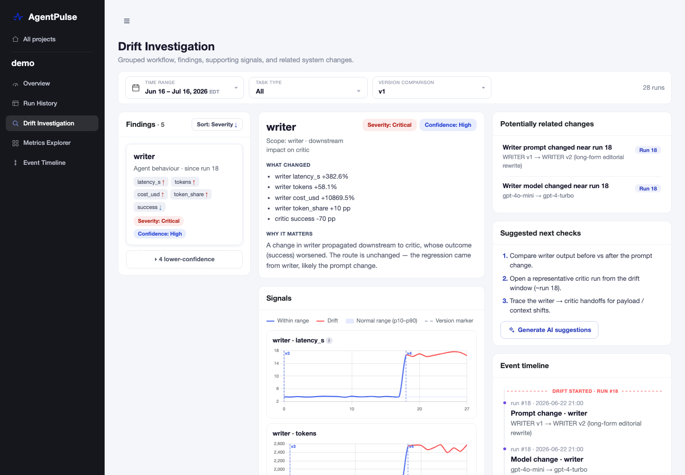
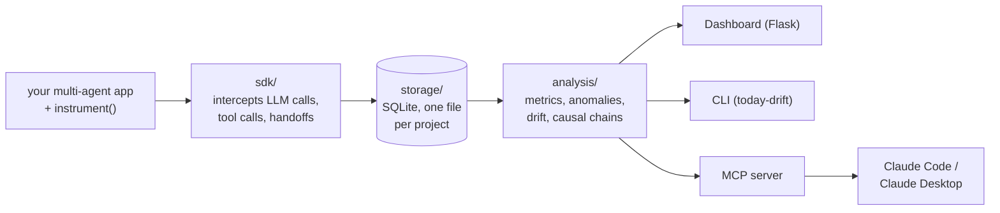
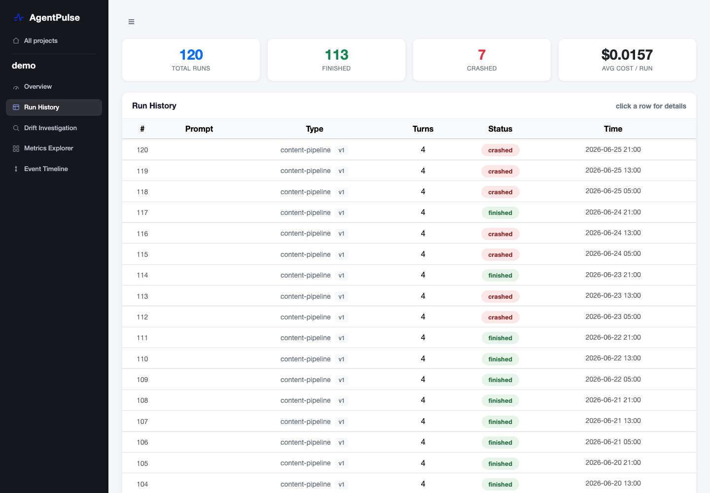
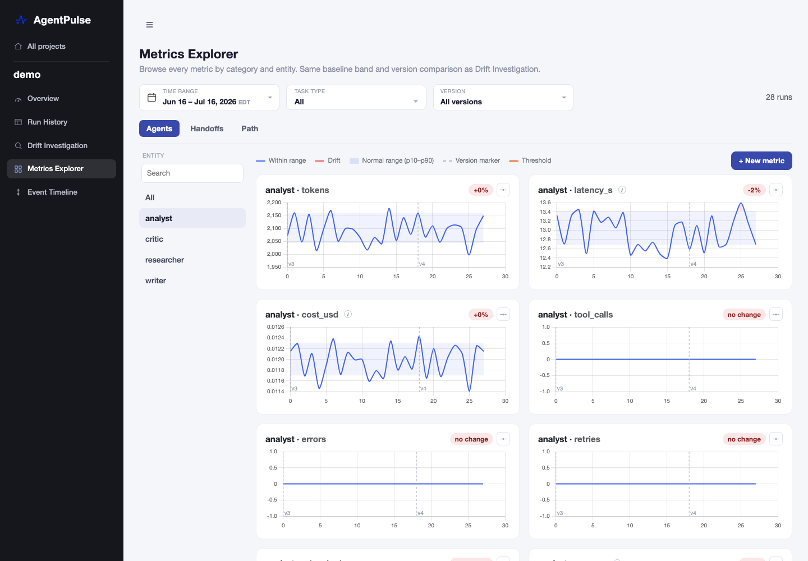

# AgentPulse

[](https://github.com/prove-ai/agentpulse/actions/workflows/tests.yml)
[](LICENSE)

> Traces tell you what happened. They don't tell you where to start investigating.

AgentPulse is an **open-source reference implementation** of drift investigation for multi-agent systems. It turns raw agent traces (tokens, cost, latency, tool calls, handoffs, DAG structure) into run, agent, handoff, route, and drift views. When an outcome degrades, it traces the drift upstream through the handoff graph to the component where it originated and presents the whole causal path.

**Who it's for.** Teams building in-house observability for multi-agent systems, and anyone exploring how agent failures should be investigated. Use the ideas, the schema, or the whole thing.

**What it's not.** A production observability platform. If you need managed tracing at scale today, use Langfuse, LangSmith, or similar tools. AgentPulse explores the layer above traces: the investigation.

If you try it, I would like to hear what worked and what did not. See [Feedback](#feedback).



*The core view: writer drifted after a prompt and model change at run 18, and critic's success dropped as a consequence. The fix belongs in writer, not critic.*

---

## Quick start

Running locally takes about a minute:

```bash
git clone https://github.com/prove-ai/agentpulse.git
cd agentpulse
python3 -m venv .venv
source .venv/bin/activate
pip install -r requirements.txt
python reporter/dashboard.py
```

Open <http://localhost:5001>. At this point you are looking at the bundled sample project (`db/demo.db`, a 4-agent content pipeline with 120 runs across 4 prompt versions and one real drift), so the Drift Investigation view above is the first thing you can reproduce.

One thing to be clear about: **AgentPulse does not collect anything on its own.** The dashboard only reads SQLite files under `db/`. To see your own agents instead of the demo, you add two lines to your system, which is the next section. Your own `db/*.db` files stay on your machine; they are gitignored, and only the demo sample is part of the repo.

---

## Architecture

One drift engine, three surfaces. The dashboard, the CLI, and the MCP server call the same engine functions, so they always agree on what "drift" means. Data flows left to right:



In words:

1. You add two lines to your app. `instrument()` patches the OpenAI and Anthropic SDKs (plus framework hooks like AutoGen's) inside your process, so every LLM call, tool call, and handoff is captured with no other code changes.
2. Captured events are written through `storage/` into a plain SQLite file per project, `db/<project>.db`. No server, no agent daemon.
3. The `analysis/` engine reads those runs and computes metrics, anomaly reports, drift findings, and causal chains.
4. Three surfaces present the same findings: the Flask dashboard, the `today-drift` CLI, and the MCP server that Claude Code or Claude Desktop connects to.

| Surface | What it's for |
|---|---|
| **Dashboard** (Flask) | Run explorer, timelines, DAGs, trends, and the Drift Investigation view |
| **CLI** (`today-drift`) | Drift findings as readable cards in your terminal, useful as a daily standup check |
| **MCP server** | The same findings inside Claude Code / Claude Desktop, so a coding agent can run the investigation |

Works with OpenAI and Anthropic SDKs. Framework agnostic: tested with AutoGen, LangChain, and plain `asyncio.gather` orchestrations.

---

## Ideas you can reuse

Even if you never run AgentPulse, these design decisions carry over to any in-house build:

1. **Detect agent, handoff, and route drift separately.** An agent getting slower, a handoff payload shrinking, and the execution path changing are different failure classes with different signals. Collapsing them into one "anomaly score" hides where to look. (`analysis/drift_detect.py`, `analysis/version_drift.py`)

2. **Severity needs corroboration, not just magnitude.** A Tier-0 (outcome) breach only escalates to critical when co-timed strong supporting signals and a plausible change event line up. A lone moving metric stays a low-confidence candidate. (`analysis/drift_detect.py`, thresholds in `config/drift_rules.yaml`)

3. **Trace the symptom to its upstream origination.** Walk the handoff graph upstream from the breached outcome and stop at the component whose input is stable but whose output drifted. That is where the fix belongs. The downstream agent that "failed" often did not change at all. (`analysis/drift_chains.py`)

4. **A change can only explain a drift if it could have caused it.** Config, prompt, and model changes are attributed only when they happened at or before the drift start, on the same or an upstream component. (`_nearby_change` in `analysis/drift_detect.py`)

5. **Give the investigation to a coding agent, not just a dashboard.** The MCP server exposes findings as structured, root-cause-led cards, so Claude can triage drift, compare releases, and propose next checks conversationally. (`agentpulse_mcp.py`, `.claude/skills/`)

6. **Pin your metric engine with a snapshot test.** Every chart value for the sample data is pinned by a fixture. A refactor that silently changes a metric fails CI loudly. (`tests/test_series_snapshot.py`)

---

## Instrumenting your system

This is the step that gets your own runs into AgentPulse. Add two lines at the top of your entrypoint (before any agent imports):

```python
import sys; sys.path.insert(0, '/path/to/agentpulse')
from sdk import instrument
instrument(task_type='my-system', prompt_version=1, db_name='my-system')
```

Then run your system as usual. Every LLM call, agent turn, tool call, and handoff is captured into `db/my-system.db`. Reload the dashboard and `my-system` appears in the sidebar picker next to `demo`. Pass a different `db_name` per system to monitor several at once.

### What gets captured

| Layer | What |
|---|---|
| Per-call | start/end timestamps, input/output tokens, model, latency |
| Per-agent turn | aggregated tokens, duration, tool calls, status, parent agent |
| Per-run | total cost, wall-clock, termination reason, prompt version |
| DAG | parent → child edges (when your orchestrator exposes them), parallel branches, join waits |

No API keys are needed to capture data or browse the dashboard; it only reads SQLite. An `ANTHROPIC_API_KEY` is needed only for the optional AI "suggest next checks" feature (see [Configuration](#configuration)).

---

## The dashboard

### Drift Investigation (`/drift2`)
The core view, shown at the top of this README: findings ranked by severity, the causal path, what changed, why it matters, potentially related changes, and suggested next checks.

### Run explorer (`/`)
Every captured run with status, route, and cost. Click through to the per-run detail page with an execution timeline (gantt), the interactive agent-chain DAG, anomalies vs the baseline, and parallel-group efficiency.



### Metrics Explorer (`/explore`)
Chart any metric for any agent, handoff, or the whole system across runs, with the same baseline bands and version markers as Drift Investigation, plus custom metrics and thresholds.



There is also a trend view (`/trends`) with agent health cards and a handoff health leaderboard, and an event timeline (`/timeline`) of prompt, model, and tool changes.

---

## CLI: `today-drift`

The drift findings as terminal cards, with no server and no Claude involved:

```bash
python cli.py                          # all projects, active drifts
python cli.py --project demo           # one project
python cli.py --range 7d               # narrower look-back window (default 30d)
python cli.py --min-severity drift     # hide low-signal watches
python cli.py --next demo:chain0       # next investigation checks for one finding
python cli.py --compare --project demo # version comparison (baseline vs newest)
python cli.py --compare --project demo --all   # step through every version pair
```

Sample output:

```
AgentPulse — 1 drift finding  · as of 2026-07-16 17:09 · range 30d · demo

● writer  ·  Agent behaviour  ·  demo
    Severity: Drift    Confidence: High
    Path:    writer → … → critic
    Why:     A change in writer propagated downstream to critic, whose outcome
             (success) worsened. The fix belongs in writer, not critic.
    Trigger: writer prompt changed near run 110
    Metrics changed (3):
        • writer latency_s +51.2%
        • writer cost_usd +1446.9%
        • critic success -9.3 pp
    active 23d, since Jun 23  ·  id demo:chain0
```

Findings carry an `id` (like `demo:chain0`). Pass it to `--next` to get the recommended follow-up checks for that finding.

There is also `report.py`, a per-run metrics report for a single project (`python report.py --all --db demo`).

---

## MCP server: let Claude run the investigation

`agentpulse_mcp.py` exposes the drift engine to Claude Code and Claude Desktop as three tools:

| Tool | What it returns |
|---|---|
| `get_todays_finding` | The drift findings active right now, as root-cause-led investigation cards (which component drifted, why, how long it's been active) |
| `get_version_comparison` | Baseline-vs-newest (or any pair, or every consecutive pair) version comparison, leading with the change that broke an outcome |
| `get_next_check_steps` | Recommended next investigation steps for a finding. AI-generated when an `ANTHROPIC_API_KEY` is configured, deterministic checks otherwise |

### Claude Code

The repo ships with a project-scoped [`.mcp.json`](.mcp.json), so if you followed the Quick start (venv at `.venv/`), just open Claude Code inside the repo and approve the server when prompted:

```bash
cd agentpulse
claude
```

Then ask things like *"what drifted today?"*, *"compare versions of the demo project"*, or *"what should I check next for demo:chain0?"*.

To register it from another directory instead:

```bash
claude mcp add agentpulse -- /path/to/agentpulse/.venv/bin/python /path/to/agentpulse/agentpulse_mcp.py
```

The repo also bundles three Claude Code **skills** under [`.claude/skills/`](.claude/skills) that build on these tools: `drift-triage` (daily standup-style triage), `drift-root-cause-report` (a written root-cause report), and `release-regression-check` (did the last release break anything?).

### Claude Desktop

Add to `claude_desktop_config.json`. Use absolute paths, because Desktop spawns servers without a working directory:

```json
{
  "mcpServers": {
    "agentpulse": {
      "command": "/path/to/agentpulse/.venv/bin/python",
      "args": ["/path/to/agentpulse/agentpulse_mcp.py"]
    }
  }
}
```

---

## Configuration

Copy [`.env.example`](.env.example) to `.env` and set `ANTHROPIC_API_KEY` to enable the AI "suggest next checks" feature (dashboard button, CLI `--next`, MCP `get_next_check_steps`). Everything else works without it; the MCP tool falls back to deterministic checks.

Drift detection thresholds and handoff rules live in [`config/drift_rules.yaml`](config/drift_rules.yaml). Edit and reload the page; no restart needed.

---

## What I want to learn

This project is an experiment in how agent failures should be investigated. If you build or operate multi-agent systems, I want to know:

- What telemetry do you actually collect for multi-agent systems, and what does AgentPulse's schema miss?
- Does the agent / handoff / route drift split match how you triage failures?
- Where is the drift detector wrong? Thresholds live in [`config/drift_rules.yaml`](config/drift_rules.yaml). If it over-fires or under-fires on your data, that is useful feedback.
- Should agent observability stay a dashboard, or become structured context for a coding agent that performs the investigation? The MCP server is a bet on the second answer.

## Feedback

**Feedback is welcome.** Please open a [GitHub issue](https://github.com/prove-ai/agentpulse/issues) for questions, ideas, or bug reports. Telemetry schemas, stories about agent failures that were hard to localize, and design disagreements are all useful.

For private feedback, contact me at [leyla@proveai.com](mailto:leyla@proveai.com).

---

## Project layout

```
agentpulse/
├── sdk/                Patches for OpenAI/Anthropic + the instrument() entry point
├── storage/            SQLite store (multi-DB aware via ContextVar)
├── analysis/           Metric engine: raw → derived → anomalies → trends → drift → DAG
├── reporter/           Flask dashboard + Jinja templates
├── cli.py              today-drift terminal CLI
├── agentpulse_mcp.py   MCP server (3 tools over the same engine)
├── report.py           Per-run metrics report CLI
├── config/             Drift rules + default prompt manifests
├── scripts/            Demo generators & import helpers
├── tests/              pytest suite (incl. a metric snapshot guard)
├── .claude/skills/     Claude Code skills built on the MCP tools
└── db/                 demo.db sample (your own project DBs land here, gitignored)
```

## Development

```bash
python -m pytest tests/          # run the test suite
```

See [CONTRIBUTING.md](CONTRIBUTING.md) for the snapshot-test workflow and guidelines.

## Requirements

- Python 3.10+
- Flask 3.x (dashboard) and `mcp` (MCP server), both in `requirements.txt`
- The multi-agent system you observe needs `openai` and/or `anthropic` installed in **its** environment. AgentPulse patches whichever it finds; neither is a hard dependency of AgentPulse itself.

## License

[MIT](LICENSE)
